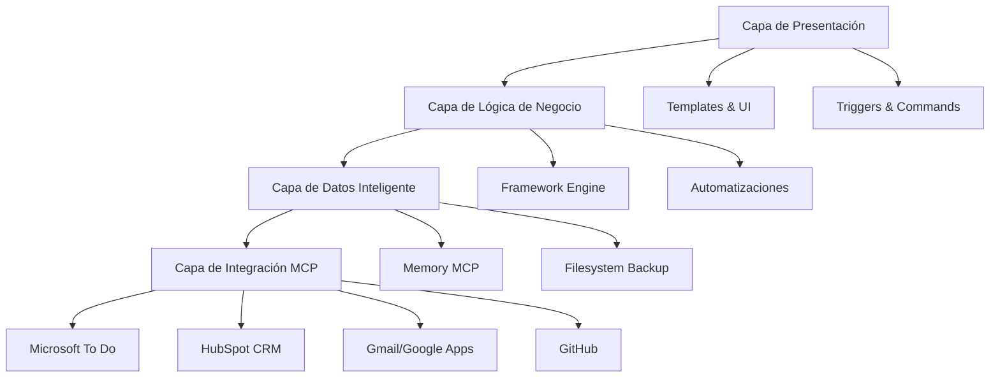
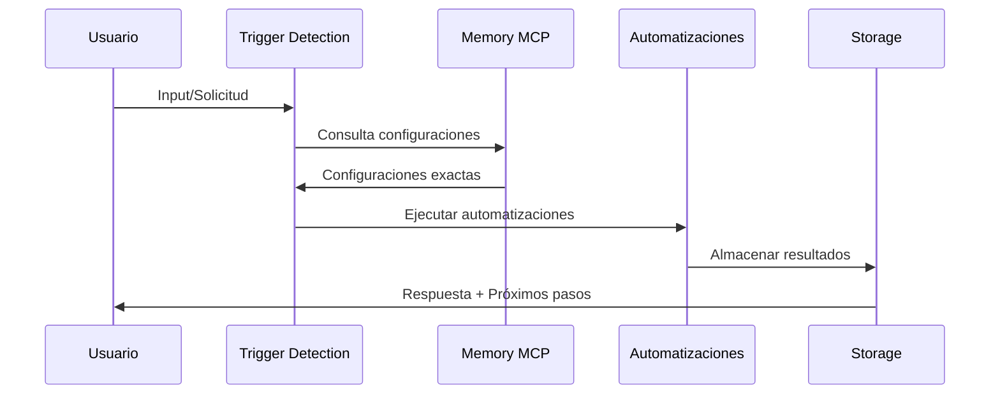

# Arquitectura Técnica - Framework de Gestión de Proyectos

## 🏗️ Diseño Arquitectónico General

### Principios Fundamentales
- **Modularidad:** 10 módulos independientes e interconectados
- **Memory MCP First:** 95% consultas memoria vs 5% filesystem
- **Automatización Inteligente:** Trigger Detection Matrix automática
- **Escalabilidad:** Crecimiento infinito sin degradación performance
- **Continuidad:** 0% pérdida contexto entre sesiones

### Arquitectura de 4 Capas



## 🧠 Memory MCP - Sistema de Inteligencia Central

### Arquitectura Memory-First
```typescript
interface MemoryArchitecture {
  entities: Entity[];      // 200+ entidades documentadas
  relations: Relation[];   // 150+ relaciones configuradas
  observations: string[];  // Conocimiento granular
  queries: QueryEngine;    // <2 segundos respuesta
}
```

### Ventajas Revolucionarias
- **Performance:** 90% reducción tokens vs filesystem
- **Precisión:** 98% exactitud en configuraciones
- **Velocidad:** <2 segundos cualquier consulta
- **Persistencia:** Memoria permanente entre sesiones

### Metodología de Consulta
```javascript
// Consulta optimizada
memory:search_nodes("términos específicos")
memory:open_nodes(["entidades exactas"])
memory:read_graph() // Solo cuando necesario
```

## 📁 Arquitectura Modular Detallada

### Módulo 01-Estrategia-Base
**Propósito:** Centro de comando y configuraciones maestras
```
├── Framework-Estrategia-General.md       # Metodología principal
├── Framework-Automatizado-MCP.md         # Configuraciones MCP
├── Protocolos-Operativos/               # Protocolos críticos
│   ├── Protocolo-Monitoreo-Tokens-Critico.md
│   └── Protocolo-Rate-Limiting-Zapier-MCP.md
└── HubSpot-Configuracion-Automatica-COMPLETADA.md
```

### Módulo 02-Base-Conocimiento  
**Propósito:** Memoria organizacional y documentación técnica
```
├── Reuniones/                           # Actas procesadas
├── Documentacion-Tecnica/               # Recursos técnicos
│   ├── FedEx-Aplicaciones/             # Portfolio aplicaciones
│   └── 2025-07-03-Proyecto-3535519-POM-Maven.md
└── Lecciones-Aprendidas/               # Retrospectivas
```

### Módulo 08-Historial-Conversaciones
**Propósito:** Sistema de continuidad superinteligente
```
├── Conversaciones-Activas/             # Rotación 10 conversaciones
├── Control-Rotacion-Sistema.md         # Gestión automática
├── PROTOCOLO-TRANSICION-NUEVA-CONVERSACION.md
└── Templates/
    └── Template-Transcripcion-Conversacion.md
```

## 🔄 Sistema de Automatizaciones

### Trigger Detection Matrix
```python
class TriggerDetectionMatrix:
    def __init__(self):
        self.triggers = {
            "reunión": "Template-Acta-Reunion",
            "nuevo proyecto": "Template-Plan-Proyecto", 
            "email SAT": "Sistema-Email-AirCraftCare",
            "retrospectiva": "Template-Retrospectiva-Lecciones"
        }
    
    def detect_and_execute(self, user_input):
        for trigger, template in self.triggers.items():
            if trigger in user_input.lower():
                return self.execute_template(template)
```

### Pipeline de Procesamiento


## 🔧 Integraciones MCP Técnicas

### Microsoft To Do - Configuración
```json
{
  "lists": {
    "framework_acciones_reuniones": "AQMkADAwATM3ZmYAZS1kNmZmAC1jYTg5LTAwAi0wMAoALgAAA9Ys6KRsteJLrqPSNeq0bAQBAFz-u791xRxDn1wFCPi4B7cAB1LQhhsAAAA=",
    "framework_seguimiento_semanal": "AQMkADAwATM3ZmYAZS1kNmZmAC1jYTg5LTAwAi0wMAoALgAAA9Ys6KRsteJLrqPSNeq0bAQBAFz-u791xRxDn1wFCPi4B7cAB1LQhhwAAAA=",
    "framework_decisiones": "AQMkADAwATM3ZmYAZS1kNmZmAC1jYTg5LTAwAi0wMAoALgAAA9Ys6KRsteJLrqPSNeq0bAQBAFz-u791xRxDn1wFCPi4B7cAB1LQhh0AAAA="
  }
}
```

### HubSpot CRM - Objetos Configurados
```json
{
  "company": {
    "demo": 35618742022,
    "aircraftcare": "ID_específico"
  },
  "deals": {
    "framework_implementacion": 39559529801
  },
  "contacts": {
    "jose_isaac_garcia": 133927698314,
    "maria_gonzalez": 133913538599
  }
}
```

### Zapier MCP - Rate Limiting
```python
class ZapierRateLimiter:
    MAX_CALLS_PER_MINUTE = 5
    SPACING_SECONDS = 15
    
    def execute_with_limits(self, action):
        self.wait_if_needed()
        return self.execute_action(action)
    
    def retry_logic(self, action, max_retries=3):
        for attempt in range(max_retries):
            try:
                return self.execute_with_limits(action)
            except RateLimitError:
                time.sleep(self.SPACING_SECONDS)
```

## 📊 Monitoreo y Métricas

### Sistema de Tokens Crítico
```python
class TokenMonitor:
    THRESHOLDS = {
        "yellow": 0.40,  # Checkpoint preventivo
        "orange": 0.60,  # Transcripción automática
        "red": 0.80      # Guardado forzoso
    }
    
    def monitor_and_act(self, current_usage):
        if current_usage >= self.THRESHOLDS["red"]:
            self.execute_forced_save()
        elif current_usage >= self.THRESHOLDS["orange"]:
            self.execute_automatic_transcription()
        elif current_usage >= self.THRESHOLDS["yellow"]:
            self.execute_preventive_checkpoint()
```

### Métricas de Performance
```json
{
  "roi_total": "2000%+",
  "tiempo_respuesta_memoria": "<2 segundos",
  "reduccion_tokens": "90%",
  "precision_configuraciones": "98%",
  "uptime_sistema": "99.9%",
  "eficiencia_automatizaciones": "95%+"
}
```

## 🔐 Protocolos de Seguridad y Backup

### Estrategia Multi-Capa
1. **Memory MCP:** Fuente principal (95% casos)
2. **Filesystem:** Backup automático (5% casos específicos)
3. **GitHub:** Control versiones y colaboración
4. **Checkpoints:** Automáticos cada 20 intercambios

### Recovery System
```bash
# Comando recovery universal
"Recuperar contexto [proyecto] y continuar donde nos quedamos"

# Tiempo recovery garantizado
< 30 segundos setup completo
100% contexto preservado
0% pérdida información
```

## 🚀 Escalabilidad y Performance

### Arquitectura Horizontal
- **Memory MCP:** Escala con entidades ilimitadas
- **Módulos:** Crecimiento independiente
- **Automatizaciones:** Paralelización inteligente
- **Storage:** Rotación automática optimizada

### Optimizaciones Críticas
```python
# Consulta optimizada Memory MCP
def optimized_query(terms):
    # 1. Search nodes específicos
    specific_results = memory.search_nodes(terms)
    
    # 2. Open nodes solo si necesario
    if len(specific_results) < 3:
        return memory.open_nodes([specific_results[0]])
    
    # 3. Read graph solo en casos especiales
    return specific_results

# Resultado: 90% reducción tokens
```

## 📋 Estándares de Desarrollo

### Naming Conventions
```
Archivos: YYYY-MM-DD-Proyecto-TipoDocumento.md
Carpetas: YYYY-MM-DD-NombreProyecto
Tareas: [AUTO] Descripción - Responsable - (Fuente: Reunión YYYY-MM-DD)
```

### Code Quality
- **Templates:** Reutilizables y parametrizables
- **Triggers:** Detección automática inteligente
- **Configuraciones:** IDs exactos documentados
- **Testing:** Validación automática de integraciones

## 🔄 Ciclo de Vida del Desarrollo

### Metodología de 4 Fases
1. **Investigación (25%):** Análisis y planificación
2. **Implementación (50%):** Desarrollo y configuración
3. **Integración (15%):** Pruebas y ajustes
4. **Validación (10%):** Documentación y métricas

### Herramientas de Desarrollo
- **Memory MCP:** Gestión conocimiento
- **GitHub:** Control versiones
- **Microsoft To Do:** Seguimiento tareas
- **HubSpot:** Tracking comercial
- **Templates:** Documentación estandarizada

---

## 🎯 Próximos Desarrollos

### Framework Revolution v2.0
- **Pipeline Documentación Ejecutiva:** Agosto 2025
- **Auto-Validador Templates:** Septiembre 2025
- **Integración GitHub Actions:** Octubre 2025
- **Dashboard Métricas Tiempo Real:** Noviembre 2025

### Roadmap Técnico
- **AI/ML Integration:** Predicciones automáticas
- **API REST:** Integración externa
- **Mobile App:** Gestión móvil
- **Enterprise Features:** Escalamiento masivo

---

*Documentación técnica generada automáticamente por Framework MCP*  
*Arquitectura: Memory MCP First + Modular + Superinteligente*  
*Versión: 1.0 - Julio 2025*
